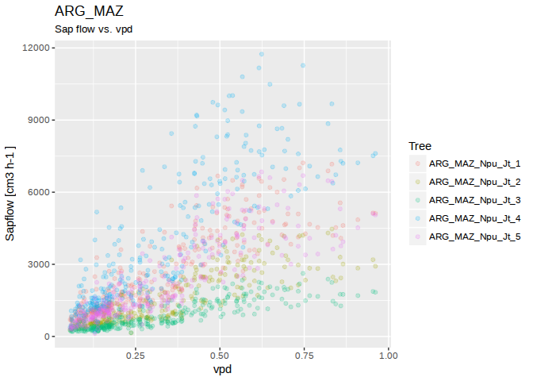
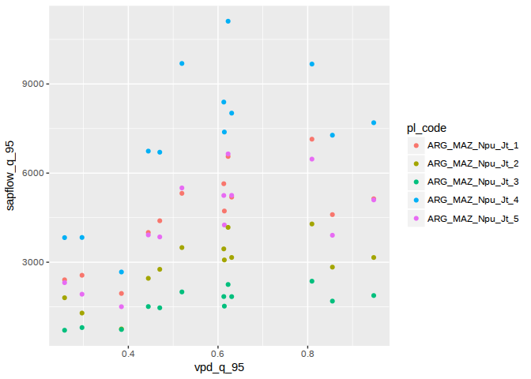
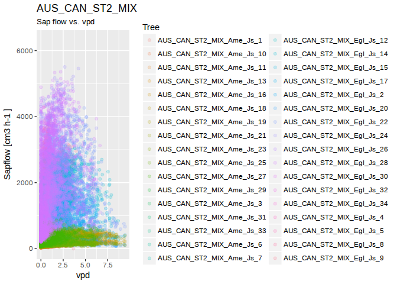

<!-- README.md is generated from README.Rmd. Please edit that file -->

# sapfluxnetr

`sapfluxnetr` provides tools for a tidy data analysis for the first
global database of sap flow measurements ([Sapfluxnet
Project](http://sapfluxnet.creaf.cat/app))

## Installation

You can install sapfluxnetr from github with:

``` r
# install.packages("devtools")
devtools::install_github('sapfluxnet/sapfluxnetr', ref = 'master',
                         build_vignettes = TRUE)
```

Be advised, `sapfluxnetr` is in active development and can contain
undiscovered bugs. If you find something not working as expected fill a
bug at <https://github.com/sapfluxnet/sapfluxnetr/issues>

## Examples

You can work with individual sites:

``` r
# load packages
library(sapfluxnetr)
# install.packages("tidyverse")
library(tidyverse)
#> ── Attaching packages ───────────────────────────────────────────────────────────────────────────────────────── tidyverse 1.2.1 ──
#> ✔ ggplot2 2.2.1     ✔ purrr   0.2.4
#> ✔ tibble  1.4.2     ✔ dplyr   0.7.4
#> ✔ tidyr   0.8.0     ✔ stringr 1.3.0
#> ✔ readr   1.1.1     ✔ forcats 0.2.0
#> ── Conflicts ──────────────────────────────────────────────────────────────────────────────────────────── tidyverse_conflicts() ──
#> ✖ dplyr::filter() masks stats::filter()
#> ✖ dplyr::lag()    masks stats::lag()

# ARG_MAZ example site data
data('ARG_MAZ', package = 'sapfluxnetr')
data('sfn_metadata_ex', package = 'sapfluxnetr')

# plot site sapflow measurements versus vpd
sfn_plot(ARG_MAZ, formula_env = ~ vpd)
```

<!-- -->

``` r

# daily sapflow standard metrics
arg_maz_metrics <- daily_metrics(ARG_MAZ)
#> [1] "Crunching data for ARG_MAZ. In large datasets this could take a while"
#> [1] "General data for ARG_MAZ"
#> [1] "Predawn data for ARG_MAZ"
#> [1] "Midday data for ARG_MAZ"

# tidy results
arg_maz_tidy <- metrics_tidyfier(arg_maz_metrics, sfn_metadata_ex)
arg_maz_tidy
#> # A tibble: 65 x 188
#>    TIMESTAMP           si_code pl_code   sapflow_centroid sapflow_coverage
#>    <dttm>              <chr>   <chr>                <dbl>            <dbl>
#>  1 2009-11-18 00:00:00 ARG_MAZ ARG_MAZ_…             17.8             100.
#>  2 2009-11-18 00:00:00 ARG_MAZ ARG_MAZ_…             18.0             100.
#>  3 2009-11-18 00:00:00 ARG_MAZ ARG_MAZ_…             17.5             100.
#>  4 2009-11-18 00:00:00 ARG_MAZ ARG_MAZ_…             17.8             100.
#>  5 2009-11-18 00:00:00 ARG_MAZ ARG_MAZ_…             18.0             100.
#>  6 2009-11-19 00:00:00 ARG_MAZ ARG_MAZ_…             13.3             100.
#>  7 2009-11-19 00:00:00 ARG_MAZ ARG_MAZ_…             13.0             100.
#>  8 2009-11-19 00:00:00 ARG_MAZ ARG_MAZ_…             13.2             100.
#>  9 2009-11-19 00:00:00 ARG_MAZ ARG_MAZ_…             13.3             100.
#> 10 2009-11-19 00:00:00 ARG_MAZ ARG_MAZ_…             13.2             100.
#> # ... with 55 more rows, and 183 more variables: sapflow_max <dbl>,
#> #   sapflow_max_time <dttm>, sapflow_mean <dbl>, sapflow_min <dbl>,
#> #   sapflow_min_time <dttm>, sapflow_n <dbl>, sapflow_q_95 <dbl>,
#> #   sapflow_q_99 <dbl>, sapflow_sd <dbl>, ta_mean <dbl>, rh_mean <dbl>,
#> #   vpd_mean <dbl>, sw_in_mean <dbl>, ws_mean <dbl>, precip_mean <dbl>,
#> #   swc_shallow_mean <dbl>, ppfd_in_mean <dbl>, ext_rad_mean <dbl>,
#> #   ta_sd <dbl>, rh_sd <dbl>, vpd_sd <dbl>, sw_in_sd <dbl>, ws_sd <dbl>,
#> #   precip_sd <dbl>, swc_shallow_sd <dbl>, ppfd_in_sd <dbl>,
#> #   ext_rad_sd <dbl>, ta_n <int>, rh_n <int>, vpd_n <int>, sw_in_n <int>,
#> #   ws_n <int>, precip_n <int>, swc_shallow_n <int>, ppfd_in_n <int>,
#> #   ext_rad_n <int>, ta_coverage <dbl>, rh_coverage <dbl>,
#> #   vpd_coverage <dbl>, sw_in_coverage <dbl>, ws_coverage <dbl>,
#> #   precip_coverage <dbl>, swc_shallow_coverage <dbl>,
#> #   ppfd_in_coverage <dbl>, ext_rad_coverage <dbl>, ta_q_95 <dbl>,
#> #   rh_q_95 <dbl>, vpd_q_95 <dbl>, sw_in_q_95 <dbl>, ws_q_95 <dbl>,
#> #   precip_q_95 <dbl>, swc_shallow_q_95 <dbl>, ppfd_in_q_95 <dbl>,
#> #   ext_rad_q_95 <dbl>, ta_q_99 <dbl>, rh_q_99 <dbl>, vpd_q_99 <dbl>,
#> #   sw_in_q_99 <dbl>, ws_q_99 <dbl>, precip_q_99 <dbl>,
#> #   swc_shallow_q_99 <dbl>, ppfd_in_q_99 <dbl>, ext_rad_q_99 <dbl>,
#> #   ta_max <dbl>, rh_max <dbl>, vpd_max <dbl>, sw_in_max <dbl>,
#> #   ws_max <dbl>, precip_max <dbl>, swc_shallow_max <dbl>,
#> #   ppfd_in_max <dbl>, ext_rad_max <dbl>, ta_max_time <dttm>,
#> #   rh_max_time <dttm>, vpd_max_time <dttm>, sw_in_max_time <dttm>,
#> #   ws_max_time <dttm>, precip_max_time <dttm>,
#> #   swc_shallow_max_time <dttm>, ppfd_in_max_time <dttm>,
#> #   ext_rad_max_time <dttm>, ta_min <dbl>, rh_min <dbl>, vpd_min <dbl>,
#> #   sw_in_min <dbl>, ws_min <dbl>, precip_min <dbl>,
#> #   swc_shallow_min <dbl>, ppfd_in_min <dbl>, ext_rad_min <dbl>,
#> #   ta_min_time <dttm>, rh_min_time <dttm>, vpd_min_time <dttm>,
#> #   sw_in_min_time <dttm>, ws_min_time <dttm>, precip_min_time <dttm>,
#> #   swc_shallow_min_time <dttm>, ppfd_in_min_time <dttm>,
#> #   ext_rad_min_time <dttm>, pl_age <dbl>, …

# plot daily aggregations
ggplot(arg_maz_tidy, aes(x = vpd_mean, y = sapflow_q_95, colour = pl_code)) +
  geom_point()
```

<!-- -->

And you can work with multiple sites:

``` r
# ARG_TRE and AUS_CAN_ST2_MIX example sites
data('ARG_TRE', package = 'sapfluxnetr')
data('AUS_CAN_ST2_MIX', package = 'sapfluxnetr')
multi_sfn <- sfn_data_multi(ARG_TRE, ARG_MAZ, AUS_CAN_ST2_MIX)

# plotting the individual sites. It creates a list of plots
plots_list <- sfn_plot(multi_sfn, formula_env = ~ vpd)
plots_list[['AUS_CAN_ST2_MIX']]
#> Warning: Removed 526066 rows containing missing values (geom_point).
```

<!-- -->

``` r

# daily sapflow standard metrics
multi_metrics <- daily_metrics(multi_sfn)
#> [1] "Crunching data for ARG_TRE. In large datasets this could take a while"
#> [1] "General data for ARG_TRE"
#> [1] "Predawn data for ARG_TRE"
#> [1] "Midday data for ARG_TRE"
#> [1] "Crunching data for ARG_MAZ. In large datasets this could take a while"
#> [1] "General data for ARG_MAZ"
#> [1] "Predawn data for ARG_MAZ"
#> [1] "Midday data for ARG_MAZ"
#> [1] "Crunching data for AUS_CAN_ST2_MIX. In large datasets this could take a while"
#> [1] "General data for AUS_CAN_ST2_MIX"
#> [1] "Predawn data for AUS_CAN_ST2_MIX"
#> [1] "Midday data for AUS_CAN_ST2_MIX"

# tidy results
multi_tidy <- metrics_tidyfier(multi_metrics, sfn_metadata_ex)
multi_tidy
#> # A tibble: 12,769 x 188
#>    TIMESTAMP           si_code  pl_code  sapflow_centroid sapflow_coverage
#>    <dttm>              <chr>    <chr>               <dbl>            <dbl>
#>  1 2006-06-20 00:00:00 AUS_CAN… AUS_CAN…              NaN               0.
#>  2 2006-06-20 00:00:00 AUS_CAN… AUS_CAN…              NaN               0.
#>  3 2006-06-20 00:00:00 AUS_CAN… AUS_CAN…              NaN               0.
#>  4 2006-06-20 00:00:00 AUS_CAN… AUS_CAN…              NaN               0.
#>  5 2006-06-20 00:00:00 AUS_CAN… AUS_CAN…              NaN               0.
#>  6 2006-06-20 00:00:00 AUS_CAN… AUS_CAN…              NaN               0.
#>  7 2006-06-20 00:00:00 AUS_CAN… AUS_CAN…              NaN               0.
#>  8 2006-06-20 00:00:00 AUS_CAN… AUS_CAN…              NaN               0.
#>  9 2006-06-20 00:00:00 AUS_CAN… AUS_CAN…              NaN               0.
#> 10 2006-06-20 00:00:00 AUS_CAN… AUS_CAN…              NaN               0.
#> # ... with 12,759 more rows, and 183 more variables: sapflow_max <dbl>,
#> #   sapflow_max_time <dttm>, sapflow_mean <dbl>, sapflow_min <dbl>,
#> #   sapflow_min_time <dttm>, sapflow_n <dbl>, sapflow_q_95 <dbl>,
#> #   sapflow_q_99 <dbl>, sapflow_sd <dbl>, ta_mean <dbl>, rh_mean <dbl>,
#> #   vpd_mean <dbl>, sw_in_mean <dbl>, ws_mean <dbl>, precip_mean <dbl>,
#> #   swc_shallow_mean <dbl>, ppfd_in_mean <dbl>, ext_rad_mean <dbl>,
#> #   ta_sd <dbl>, rh_sd <dbl>, vpd_sd <dbl>, sw_in_sd <dbl>, ws_sd <dbl>,
#> #   precip_sd <dbl>, swc_shallow_sd <dbl>, ppfd_in_sd <dbl>,
#> #   ext_rad_sd <dbl>, ta_n <int>, rh_n <int>, vpd_n <int>, sw_in_n <int>,
#> #   ws_n <int>, precip_n <int>, swc_shallow_n <dbl>, ppfd_in_n <int>,
#> #   ext_rad_n <int>, ta_coverage <dbl>, rh_coverage <dbl>,
#> #   vpd_coverage <dbl>, sw_in_coverage <dbl>, ws_coverage <dbl>,
#> #   precip_coverage <dbl>, swc_shallow_coverage <dbl>,
#> #   ppfd_in_coverage <dbl>, ext_rad_coverage <dbl>, ta_q_95 <dbl>,
#> #   rh_q_95 <dbl>, vpd_q_95 <dbl>, sw_in_q_95 <dbl>, ws_q_95 <dbl>,
#> #   precip_q_95 <dbl>, swc_shallow_q_95 <dbl>, ppfd_in_q_95 <dbl>,
#> #   ext_rad_q_95 <dbl>, ta_q_99 <dbl>, rh_q_99 <dbl>, vpd_q_99 <dbl>,
#> #   sw_in_q_99 <dbl>, ws_q_99 <dbl>, precip_q_99 <dbl>,
#> #   swc_shallow_q_99 <dbl>, ppfd_in_q_99 <dbl>, ext_rad_q_99 <dbl>,
#> #   ta_max <dbl>, rh_max <dbl>, vpd_max <dbl>, sw_in_max <dbl>,
#> #   ws_max <dbl>, precip_max <dbl>, swc_shallow_max <dbl>,
#> #   ppfd_in_max <dbl>, ext_rad_max <dbl>, ta_max_time <dttm>,
#> #   rh_max_time <dttm>, vpd_max_time <dttm>, sw_in_max_time <dttm>,
#> #   ws_max_time <dttm>, precip_max_time <dttm>,
#> #   swc_shallow_max_time <dttm>, ppfd_in_max_time <dttm>,
#> #   ext_rad_max_time <dttm>, ta_min <dbl>, rh_min <dbl>, vpd_min <dbl>,
#> #   sw_in_min <dbl>, ws_min <dbl>, precip_min <dbl>,
#> #   swc_shallow_min <dbl>, ppfd_in_min <dbl>, ext_rad_min <dbl>,
#> #   ta_min_time <dttm>, rh_min_time <dttm>, vpd_min_time <dttm>,
#> #   sw_in_min_time <dttm>, ws_min_time <dttm>, precip_min_time <dttm>,
#> #   swc_shallow_min_time <dttm>, ppfd_in_min_time <dttm>,
#> #   ext_rad_min_time <dttm>, pl_age <dbl>, …

# plot daily aggregations
ggplot(multi_tidy, aes(x = vpd_mean, y = sapflow_q_95, colour = si_code)) +
  geom_point(alpha = 0.2)
#> Warning: Removed 10966 rows containing missing values (geom_point).
```

<!-- -->
