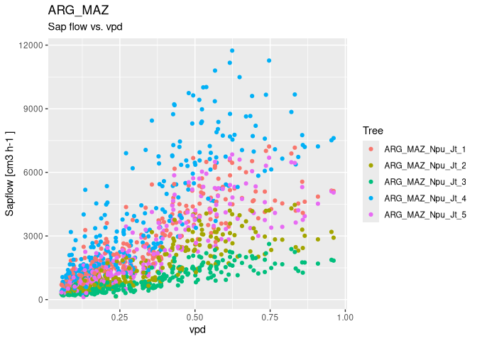
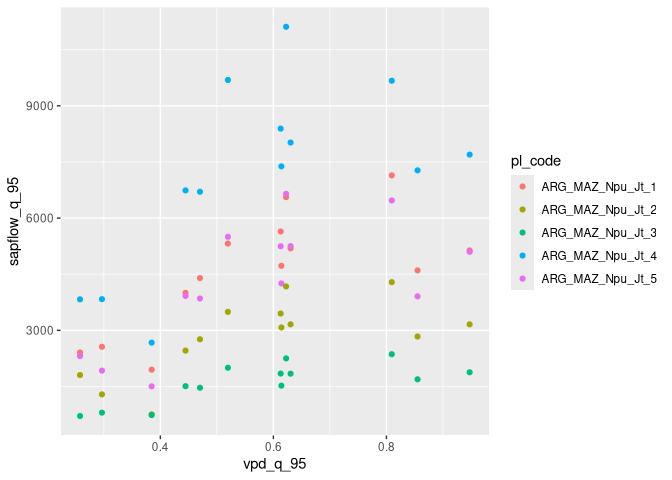
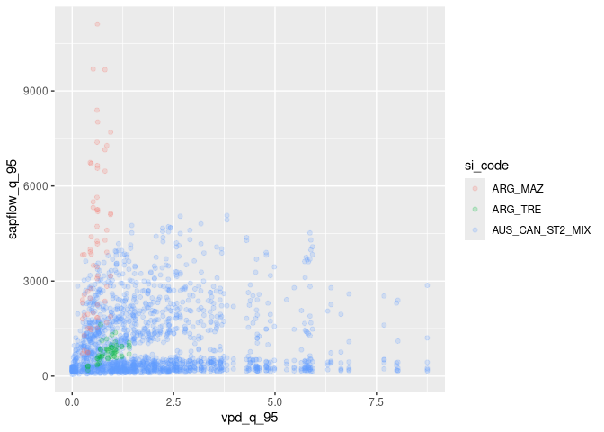

<!-- README.md is generated from README.Rmd. Please edit that file -->

# sapfluxnetr

[](https://travis-ci.org/sapfluxnet/sapfluxnetr)

`sapfluxnetr` provides tools for a tidy data analysis for the first
global database of sap flow measurements ([Sapfluxnet
Project](http://sapfluxnet.creaf.cat))

## Examples

You can work with individual sites:

``` r
# load packages
library(sapfluxnetr)
# install.packages("tidyverse")
library(tidyverse)
#> ── Attaching packages ────────────────────────── tidyverse 1.2.1 ──
#> ✔ ggplot2 3.1.0     ✔ purrr   0.3.0
#> ✔ tibble  2.0.0     ✔ dplyr   0.7.8
#> ✔ tidyr   0.8.2     ✔ stringr 1.3.1
#> ✔ readr   1.3.1     ✔ forcats 0.3.0
#> ── Conflicts ───────────────────────────── tidyverse_conflicts() ──
#> ✖ dplyr::filter() masks stats::filter()
#> ✖ dplyr::lag()    masks stats::lag()

# ARG_MAZ example site data
data('ARG_MAZ', package = 'sapfluxnetr')
data('sfn_metadata_ex', package = 'sapfluxnetr')

# plot site sapflow measurements versus vpd
sfn_plot(ARG_MAZ, formula_env = ~ vpd)
```



``` r

# daily sapflow and environmental metrics
arg_maz_metrics <- daily_metrics(
  ARG_MAZ, tidy = TRUE, metadata = sfn_metadata_ex
)
#> [1] "Crunching data for ARG_MAZ. In large datasets this could take a while"
#> [1] "General data for ARG_MAZ"

# plot daily aggregations
ggplot(arg_maz_metrics, aes(x = vpd_q_95, y = sapflow_q_95, colour = pl_code)) +
  geom_point()
```



And you can work with multiple sites:

``` r
# ARG_TRE and AUS_CAN_ST2_MIX example sites
data('ARG_TRE', package = 'sapfluxnetr')
data('AUS_CAN_ST2_MIX', package = 'sapfluxnetr')
multi_sfn <- sfn_data_multi(ARG_TRE, ARG_MAZ, AUS_CAN_ST2_MIX)

# plotting the individual sites. It creates a list of plots
plots_list <- sfn_plot(multi_sfn, formula_env = ~ vpd)
plots_list[['AUS_CAN_ST2_MIX']]
#> Warning: Removed 526066 rows containing missing values (geom_point).
```


``` r

# daily sapflow standard metrics
multi_metrics <- daily_metrics(
  multi_sfn, tidy = TRUE, metadata = sfn_metadata_ex
)
#> [1] "Crunching data for ARG_TRE. In large datasets this could take a while"
#> [1] "General data for ARG_TRE"
#> [1] "Crunching data for ARG_MAZ. In large datasets this could take a while"
#> [1] "General data for ARG_MAZ"
#> [1] "Crunching data for AUS_CAN_ST2_MIX. In large datasets this could take a while"
#> [1] "General data for AUS_CAN_ST2_MIX"

# plot daily aggregations
ggplot(multi_metrics, aes(x = vpd_q_95, y = sapflow_q_95, colour = si_code)) +
  geom_point(alpha = 0.2)
#> Warning: Removed 10966 rows containing missing values (geom_point).
```



## Installation

You can install sapfluxnetr from github with the `remotes` package:

``` r
# if (!require(remotes)) {install.packages('remotes')}
remotes::install_github(
  'sapfluxnet/sapfluxnetr',
  build_opts = c("--no-resave-data", "--no-manual", "--build-vignettes")
)
```

Be advised, `sapfluxnetr` is in active development and can contain
undiscovered bugs. If you find something not working as expected fill a
bug at <https://github.com/sapfluxnet/sapfluxnetr/issues>

## Overview

Please see `vignette('sapfluxnetr-quick-guide', package =
'sapfluxnetr')` for a detailed overview of the package capabilities.
