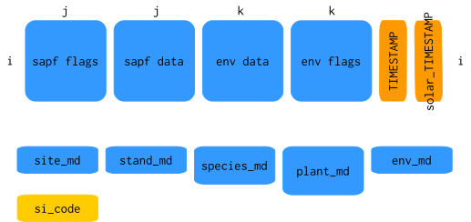

```{r setup, include = FALSE}
knitr::opts_chunk$set(
  collapse = TRUE,
  comment = "#>"
)
```

# `sfn_data`

`sfn_data` is a S4 class designed for store and interact with Sapfluxnet sites
data and metadata.

## Slots

`sfn_data` class has twelve different slots:

  1. **sapf_data**: Tibble containing sapflow data, without TIMESTAMP variable.
  
  2. **env_data**: Tibble containing environmental data, without TIMESTAMP
     variable.
  
  3. **sapf_flags**: Tibble with the same dimensions as sapf_data, containing
     the flags for each element of sapf_data.
  
  4. **env_flags**: Tibble with the same dimensions as env_data, containing
     the flags for each element of env_data.
  
  5. **si_code**: Character vector of length 1 with the
     site code.
  
  6. **timestamp**: POSIXct vector of length equal to `nrow(sapf_data)` with the
     timestamp.
  
  7. **solar_timestamp**: POSIXct vector of length equal to `nrow(sapf_data)`
     with the aparent solar timestamp.
  
  7. **site_md**: Tibble with the site metadata.
  
  8. **stand_md**: Tibble with the stand metadata.
  
  9. **species_md**: Tibble with the species metadata.
  
  10. **plant_md**: Tibble with the plant metadata.
  
  11. **env_md**: Tibble with the environmental metadata.

### Class design

The schematics of the class are summarised in Fig 1.



This design have some characteristics:

  + **Dimensions**: Dimensions must comply:  
  
    `nrow(sapf_data) == nrow(env_data) == nrow(sapf_flags) == nrow(env_flags) == length(timestamp) == length(solar_timestamp)`  
    
    `ncol(sapf_data) == ncol(sapf_flags)`  
    
    `ncol(env_data) == ncol(env_flags)`  
    
    In the case of differences in the dimensions of between environmental and
    sap flow data, NAs must be added when equalising both TIMESTAMPs (i.e. if
    env data is longer than sapf data, rows are added to the later with NAs to
    make them equal, and flags ("NA_ADDED") are raised to indicate the adding).

  + **si_code slot**: This slot indicates the site. This is useful for
    identifying the site in the metrics functions results.
  
  + **Compartimentalization**: `timestamp` and `solar_timestamp` are isolated
    from data (sapf and env) in their own slot. This made easier subsetting the
    object and open the possibility of working with the timestamps only.
  
  + **Flags**: Two slots are used for storing data flags. As the flag slots
    have the same dimensions as the corresponding dataset slot, selection of
    flagged data is straightforward:  
    
    `sapf_data[flag_data == "flag", ]`


## Methods

Some methods are included in the class:

  + `show`: calling a sfn_data object shows info about it
  
```{r show}
library(sapfluxnetr)
data('FOO', package = 'sapfluxnetr')
FOO
```
  
  + `get methods`: methods to get any slot outside the object. In the case
    of sapf and env data, TIMESTAMP is added (based on the `solar` argument) in
    order to obtain fully functional datasets. See `?sfn_get_methods` for more
    details.
    
```{r get_methods}
get_sapf_data(FOO, solar = FALSE)
get_sapf_data(FOO, solar = TRUE)
get_env_data(FOO) # solar default is FALSE
get_sapf_flags(FOO) # solar default is FALSE
get_env_flags(FOO) # solar default is FALSE
get_si_code(FOO)
get_timestamp(FOO)[1:10]
get_solar_timestamp(FOO)[1:10]
get_site_md(FOO)
get_stand_md(FOO)
get_species_md(FOO)
get_plant_md(FOO)
get_env_md(FOO)
```
    
  + `assignation`: methods for `"<-"` are implemented, allowing transformation
    of the slots. This is used internally in some functions but is not
    recommended except for updating metadata slots. In data slots this
    changes are not reflected in the flags, so the reproducibility and
    traceability will be lost if used without care.
    See `?sfn_replacement_methods` for more details.
    
```{r assignation}
# extraction and modification
foo_site_md <- get_site_md(FOO)
foo_site_md[['si_biome']]
foo_site_md[['si_biome']] <- 'Temperate forest'
# assignation
get_site_md(FOO) <- foo_site_md
# check it worked
get_site_md(FOO)[['si_biome']]
```
  
  + `validation`: a validation method is implemented in order to avoid creation
    of invalid sfn_data objects (i.e objects with different data dimensions,
    objects without metadata...)
    
```{r validation, error=TRUE, purl=FALSE, collapse=FALSE}
# get sapflow data
foo_bad_sapf <- get_sapf_data(FOO)
# pull a row, now it has diferent dimensions than
foo_bad_sapf <- foo_bad_sapf[-1,]
# try to assign the incorrect data fails
get_sapf_data(FOO) <- foo_bad_sapf[,-1] # ERROR
# try to build a new object also fails
sfn_data(
  sapf_data = foo_bad_sapf[,-1], # remember to remove timestamp column
  env_data = get_env_data(FOO)[,-1],
  sapf_flags = get_env_flags(FOO)[,-1],
  env_flags = get_env_flags(FOO)[,-1],
  si_code = get_si_code(FOO),
  timestamp = get_timestamp(FOO),
  solar_timestamp = get_solar_timestamp(FOO),
  site_md = get_site_md(FOO),
  stand_md = get_stand_md(FOO),
  species_md = get_species_md(FOO),
  plant_md = get_plant_md(FOO),
  env_md = get_env_md(FOO)
)
```

## Utilities

`sapfluxnetr` package offers some utilities to visulaize and work with sfn_data
objects:

### `sfn_plot`

This function allows to plot `sfn_data` objects. See `?sfn_plot` for more
details.
  
```{r sfn_plot, fig.width=6}
library(ggplot2)

sfn_plot(FOO, type = 'env') +
  facet_wrap(~ Variable, ncol = 3, scales = 'free_y') +
  theme(legend.position = 'none')

sfn_plot(FOO, formula_env = ~ vpd) +
  theme(legend.position = 'none')
```
  
### `sfn_filter`

This function emulates `filter` function from `dplyr` package for `sfn_data`
objects. Useful to filter by some especific timestamp. Be advised, using this
funcion to filter by sapflow or environmental variables can create TIMESTAMP
gaps. See `sfn_filter` for more details.
    
```{r sfn_filter}
library(lubridate)
library(dplyr)

# get only the values for november
sfn_filter(FOO, month(TIMESTAMP) == 11)
```
    
### `sfn_mutate`

This function allows mutation of data variables inside the `sfn_data` object.
Useful when you need to transform a variable to another units or similar. A flag
('USER_MODF') will be added to all values in the mutated variable. See
`sfn_mutate` for more details.

  > At this moment, mutate does not allows creating new variables, only mutate
    existing variables
    
```{r sfn_mutate}
# transform ws from m/s to km/h
foo_mutated <- sfn_mutate(FOO, ws = ws * 3600/1000)
get_env_data(foo_mutated)[['ws']][1:10]
```
  
### `sfn_mutate_at`

This function mutates all variables declared with the function provided. Useful
when you need to conditionally transform the data, i.e. converting to NA sapflow
values when an environmental variable exceeds some threshold. See
`sfn_mutate_at` for more details.
    
```{r sfn_mutate_at}
foo_mutated_2 <- sfn_mutate_at(
  FOO,
  vars(one_of(names(get_sapf_data(FOO)[,-1]))),
  funs(case_when(
    ws > 25 ~ NA_real_,
    TRUE ~ .
  ))
)

# see the difference between FOO and foo_mutated_2
get_sapf_data(FOO)
get_sapf_data(foo_mutated_2)
```

### `*_metrics` functions

Family of functions to aggregate and summarise the site data. See `?metrics` for
more details.
    
```{r metrics}
foo_daily <- daily_metrics(FOO)
foo_daily[['sapf']][['sapf_gen']]
```

For full control of metrics and custom aggregations see
`vignette('custom-aggregation', package = 'sapfluxnetr')`

# `sfn_data_multi`

`sfn_data_multi` is an S4 class designed to store multiple `sfn_data` objects.
It inherits from list so, in a nutshell, `sfn_data_multi` is a list of
`sfn_data` objects.

## Methods

`sfn_data_multi` has only one custom method declared.
  
  + show
  
```{r show_multi}
data(BAR, package = 'sapfluxnetr')
data(BAZ, package = 'sapfluxnetr')
multi_sfn <- sfn_data_multi(FOO, BAR, BAZ)

multi_sfn
```

It shows the number and codes of site composing the multi object and the
combined timestamp span of all the sites contained.

## Utilities

All the utilities that exists for `sfn_data` work for `sfn_data_multi` objects,
executing the function for all the sites contained in the `sfn_data_multi`
object:

### `sfn_plot`

```{r plot_multi, fig.show='hold', fig.width=3.4}
multi_plot <- sfn_plot(multi_sfn, formula = ~ vpd)
multi_plot[['FOO']] + theme(legend.position = 'none')
multi_plot[['BAZ']] + theme(legend.position = 'none')
```


### `sfn_filter`

```{r sfn_filter_multi}
multi_filtered <- sfn_filter(multi_sfn, month(TIMESTAMP) == 11)
get_timestamp(multi_filtered[['BAZ']])[1:10]
```

### `sfn_mutate`
  
```{r sfn_mutate_multi}
multi_mutated <- sfn_mutate(multi_sfn, ws = ws * 3600/1000)
get_env_data(multi_mutated[['BAZ']])[['ws']][1:10]
```

### `sfn_mutate_at`

```{r sfn_mutate_at_multi}
vars_to_not_mutate <- c(
  "TIMESTAMP", "ta", "rh", "vpd", "sw_in", "ws",
  "precip", "swc_shallow", "ppfd_in", "ext_rad"
)

multi_mutated_2 <- sfn_mutate_at(
  multi_sfn,
  vars(-one_of(vars_to_not_mutate)),
  funs(case_when(
    ws > 25 ~ NA_real_,
    TRUE ~ .
  ))
)

multi_mutated_2[['FOO']]
```

### `*_metrics`

```{r metrics_multi}
multi_metrics <- daily_metrics(multi_sfn)
multi_metrics[['FOO']][['sapf']][['sapf_gen']]
```
